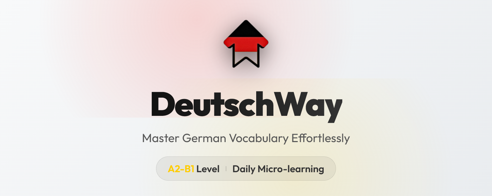
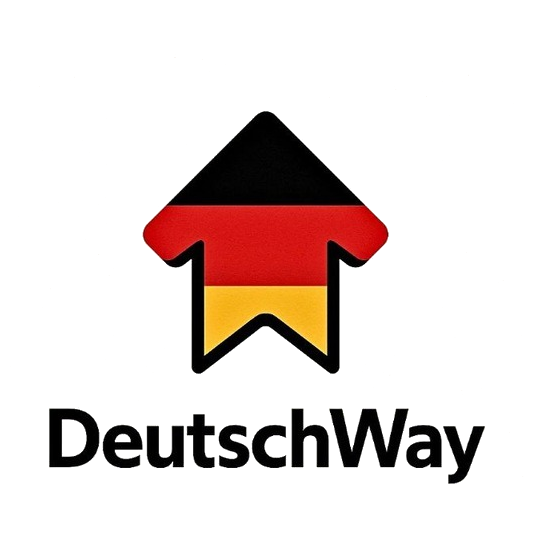

<div align="center">
  
  <br />
  
  <h1>Deutschway</h1>
  <p><em>Master German Vocabulary Effortlessly. A2-B1 Level Daily Micro-learning.</em></p>
  
  <div>
    
    
    
    
  </div>
</div>

---

## 🌟 Overview

**Deutschway** is a beautifully crafted Progressive Web App (PWA) and Chrome Extension designed to help you build a consistent German learning habit. Every single day, the first time you open Google Chrome, Deutschway automatically opens a tab presenting you with 5 carefully curated German words (A2-B1 level) to learn and write down. 

No more forgetting to practice!

## ✨ Features

- **Daily Automation**: Chrome extension automatically launches the app once a day.
- **Curated Database**: Over 150+ high-quality A2-B1 German words with translations, sample sentences, and sentence translations.
- **Streak Tracking**: Built-in Duolingo-style streak tracker to keep you motivated.
- **Premium UI/UX**: Sleek glassmorphism design, smooth micro-animations, and rich typography (`Playfair Display` + `Inter`).
- **Dark/Light Mode**: Beautiful themes accented with subtle German flag colors.
- **PWA Ready**: Install the app directly to your desktop or mobile home screen.

## 🚀 Installation

### 1. Web App
The web app is hosted live via GitHub Pages. You can visit it here:
**[https://officiallygod.github.io/Deutschway/](https://officiallygod.github.io/Deutschway/)**

*(Note: If the site currently just says "Deutschway", the GitHub Actions automated deployment is still processing. Please wait a few minutes or manually run the "Deploy static content to Pages" action in the Actions tab).*

### 2. Chrome Extension
To get the automated daily pop-up:
1. Open Google Chrome and navigate to `chrome://extensions/`
2. Enable **Developer mode** (toggle in the top right corner).
3. Click the **Load unpacked** button.
4. Select the `extension` folder inside this repository.

## 🛠️ Tech Stack

- **Frontend**: React + Vite
- **Styling**: SCSS (Vanilla CSS variables with Glassmorphism)
- **Extension**: Manifest V3 (Vanilla JS Background Service Worker)
- **Deployment**: GitHub Actions -> GitHub Pages

## 📚 Expanding the Dictionary
Want to add more words? 
Simply open `webapp/src/data/words.json` and append new entries using the following format:
```json
{
  "word": "das Beispiel",
  "translation": "Example",
  "example": "Das ist ein gutes Beispiel.",
  "exampleTranslation": "That is a good example."
}
```

---
<div align="center">
  <em>Viel Erfolg beim Deutschlernen! 🇩🇪</em>
</div>
